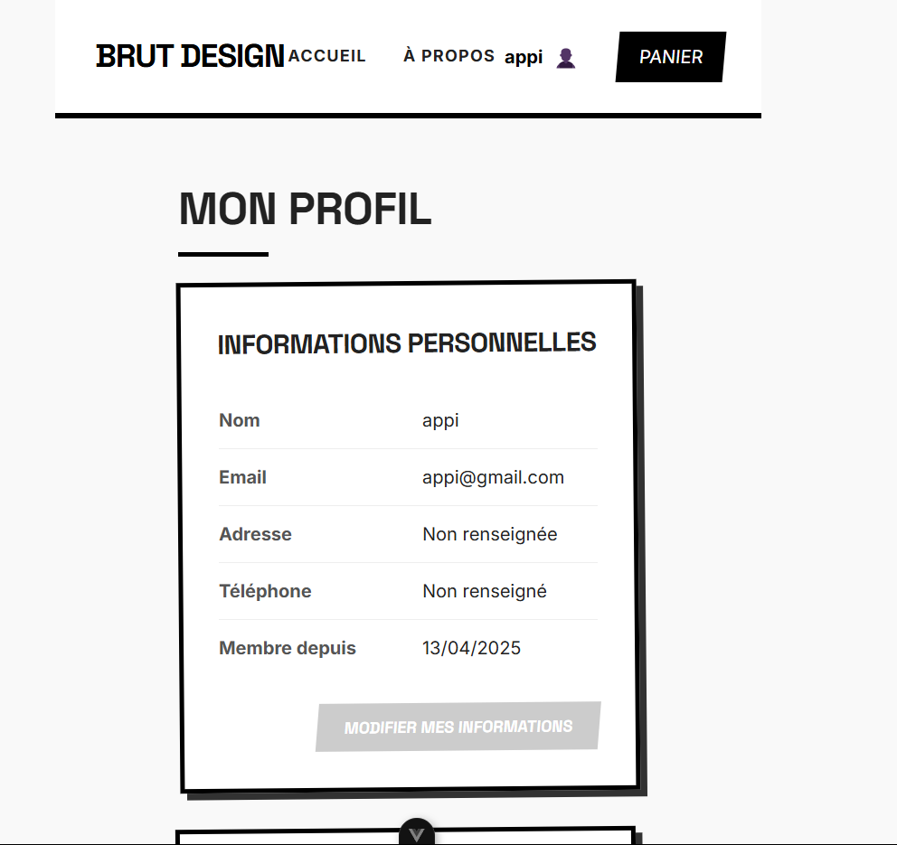
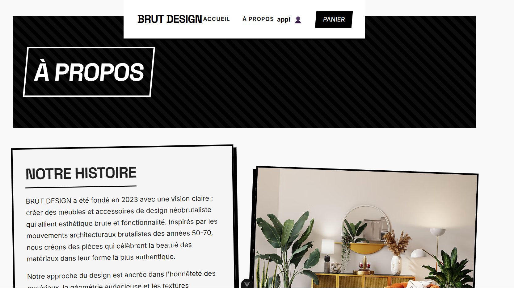
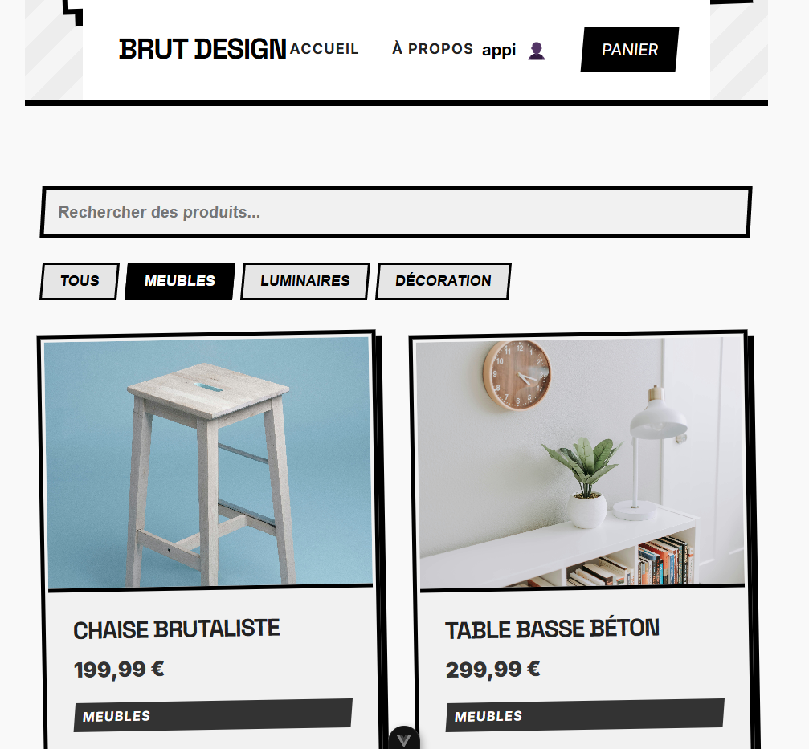

# 🎨 BRUT DESIGN - Une Aventure e-Commerce

<div align="center">
  
  <h3>Un site e-commerce néo-brutaliste créé avec passion et IA 🚀</h3>
</div>

## 📖 Notre Histoire

Ce projet est né d'une expérience unique : créer un site e-commerce complet avec l'aide de GitHub Copilot, sans toucher directement au code. Une aventure entre amis qui s'est transformée en une réalisation bluffante !

### 🎯 Le Concept

BRUT DESIGN, fondé en 2023, est notre vision du design néo-brutaliste appliqué au mobilier contemporain. Notre plateforme propose des meubles et accessoires qui allient esthétique brute et fonctionnalité.

## 🖼️ Aperçu du Site

### Page Profil

*Une interface épurée pour gérer vos informations personnelles*

### À Propos

*Notre histoire et notre vision du design néo-brutaliste*

### Catalogue Produits

*Une sélection de meubles au design unique et audacieux*

## 🛠️ Technologies Utilisées

- **Frontend**: Vue.js 3 avec Vite
- **Backend**: Go
- **Base de données**: SQLite
- **Assistant de développement**: GitHub Copilot 🤖

## ✨ Points Forts du Projet

- Design néo-brutaliste unique
- Interface utilisateur intuitive
- Gestion complète du panier
- Espace administrateur
- Système d'authentification sécurisé

## 🎉 Le Résultat

Ce qui a commencé comme une expérimentation s'est transformé en un projet complet et fonctionnel. Le résultat est bluffant : un site e-commerce professionnel avec une identité visuelle forte et des fonctionnalités complètes, le tout créé en collaboration avec l'IA.

## 👥 L'Équipe

Un groupe d'amis passionnés par le design et la technologie, accompagnés par GitHub Copilot dans cette aventure créative.

## 🚀 Installation et Démarrage

```bash
# Frontend (Dans le dossier Front)
npm install
npm run dev

# Backend (Dans le dossier ecommerce-backend)
go mod download
go run cmd/main.go
```

## 📝 Note

Ce projet démontre la puissance de la collaboration entre l'humain et l'IA dans le développement moderne. Nous avons prouvé qu'avec de la créativité et les bons outils, on peut créer quelque chose d'unique et de professionnel !

---

<div align="center">
  <p>Fait avec ❤️ par des passionnés de design et de code</p>
  <p>© 2023-2025 BRUT DESIGN</p>
</div>